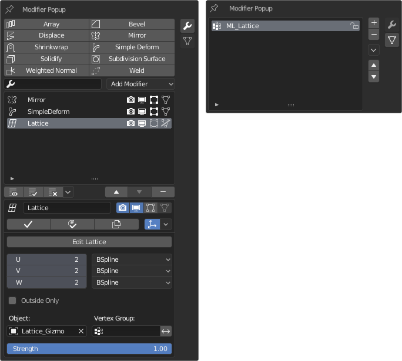
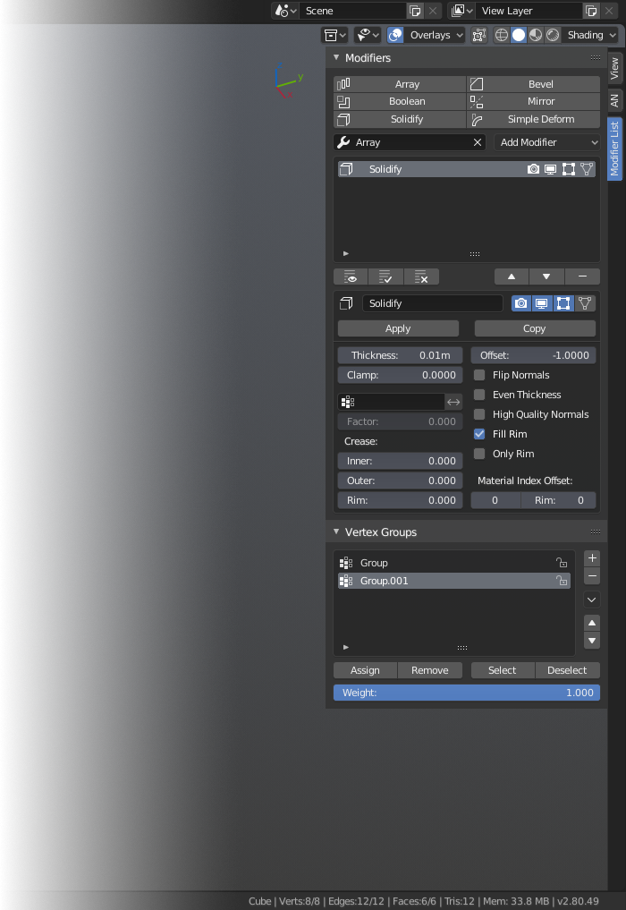

# Modifier List
*(previously called Modifier Popup Panel)*

### Popup + Sidebar tab for showing modifiers in the viewport

---

[Download the latest release from here](https://github.com/Symstract/Modifier-List/releases)

[Changelog](/CHANGELOG.md)

[Blender Artists Thread](https://blenderartists.org/t/modifier-popup-panel-list-view-search-favourites/1147752)

---

## Features

- **List view of modifiers.** Popup's default list size can be set in addon preferences.
- **Modifier search**
- **Modifier menu**
- **Favourite modifiers** which can be set in addon preferences
- **Ability to apply modifiers in edit mode (kind of).** The apply operator acts as a macro when used in edit mode and automatically switches to object mode, applies the modifier and switches back to edit mode.
- **Modifier batch operators from built-in Modifier Tools add-on** (when that addon is enabled)
- **Vertex group list**
- **Option for disabling sidebar tab.** (Option for popup will be added later.)

## Popup Hotkey

Default hotkey is **alt + space**. In the keymap editor, you can find it under 3D View > 3D View (Global) > Modifier Popup Panel.

## Installation

1. Go to Edit menu (File menu in 2.79) and open user preferences
2. Switch to Addons tab and click Install...
3. Navigate to where you downloaded the zip file to, select it and click Install Add-on from File
4. Enable the add-on by ticking the check box next to the add-on's name
5. (Optional) Search for Modifier Tools add-on and enable it to get modifier batch operators under the modifier list
6. Save user preferences

## Future Ideas

- Make radial arrays easier to create and edit
- One click way to add control empty for any modifier

## Known Issues and Limitations

- In the popup, lists don't remember their sizes when they are resized. Popups are not really ment for this kind of stuff, so that's a limitation of Blender.
- Modifier search and modifier menu always display all modifiers, even when all of them are not applicable to the type of the active object. Maybe I will change that in a future release.
- Using the popup, picking an object from viewport is not possible. A limitation of popups. Hopefully that could be possible at some point because that applies also to the driver editor popup. We’ll see.