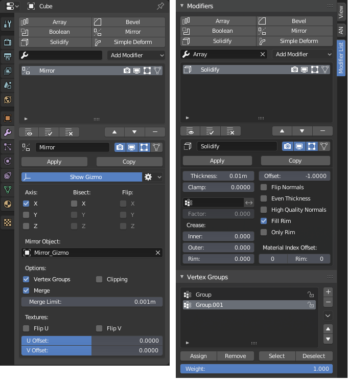

# Modifier List

### Alternative UI layout for modifiers with handy features. Available also inside the sidebar and as a popup.

---

[Download the latest release from here](https://github.com/Symstract/Modifier-List/releases)

[Changelog](/CHANGELOG.md)

[Blender Artists Thread](https://blenderartists.org/t/modifier-popup-panel-list-view-search-favourites/1147752)

---

## Features

- **List view of modifiers.** Popup's default list size can be set in addon preferences.
- **Modifier search**
- **Modifier menu**
- **Favourite modifiers** which can be set in addon preferences
- **Ability to apply modifiers in edit mode (kind of).** The apply operator acts as a macro when used in edit mode and automatically switches to object mode, applies the modifier and switches back to edit mode.
- **Modifier batch operators from built-in Modifier Tools add-on** (when that addon is enabled)
- **Sidebar tab and popup**, which contain also a vertex group list. The sidebar tab can be disabled from addon preferences.
- **Easy way to add a control object** - or as I decided to call them, **a gizmo object** - to a modifier
  - There is Add Gizmo button for adding a "gizmo object" to a modifier. It basically just adds an empty and assings it to the appropriate property of the modifier.
  -  By default, the gizmo is placed at the origin of the active object. But if you are in edit mode and have a single vertex selected, the gizmo is placed at the vertex location.
  - You can also hold shift when adding a modifier to add a gizmo at the same time, so you can save an extra click :)
  - After adding a gizmo, the Add Gizmo button changes to a visibility toggle and a settings popover, in which you can change some gizmo setting, such as its location, rotation and parenting. You can also select or delete the gizmo from the popover. Note: selecting and deleting give some (harmless) errors/glitches when used from the modifier popup.
  - There is a setting in addon preferences for automatically parenting the gizmo to the active object on addition.
  - You can hold shift when applying or removing a modifier to also delete its gizmo.
- **Auto Smooth is enabled automatically when you add a Weighted Normal modifier**.

## Popup Hotkey

Default hotkey is **alt + space**. In the keymap editor, you can find it under 3D View > 3D View (Global) > Modifier Popup Panel.

## Installation

1. Go to Edit menu (File menu in 2.79) and open user preferences
2. Switch to Addons tab and click Install...
3. Navigate to where you downloaded the zip file to, select it and click Install Add-on from File
4. Enable the add-on by ticking the check box next to the add-on's name
5. (Optional) Search for Modifier Tools add-on and enable it to get modifier batch operators under the modifier list
6. Save user preferences

## Known Issues and Limitations

- In the popup, lists don't remember their sizes when they are resized. Popups are not really ment for this kind of stuff, so that's a limitation of Blender.
- Using the popup, picking an object from viewport is not possible. A limitation of popups. Hopefully that could be possible at some point because that applies also to the driver editor popup. We’ll see.