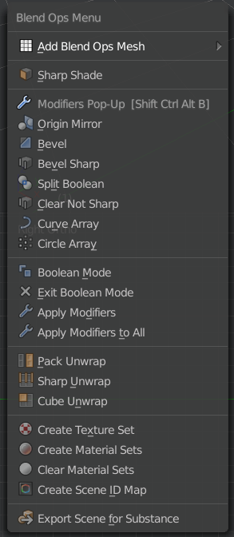

# Modifier Popup Panel

## Features

- **List view of modifiers.** Default list size can be set in addon preferences.
- **Modifier search**
- **Modifier menu**
- **Favourite modifiers** which can be set in addon preferences
- **Ability to apply modifiers in edit mode (kind of).** The apply operator acts as a macro when used in edit mode and automatically switches to object mode, applies the modifier and switches back to edit mode.
- **Modifier batch operators from built-in Modifier Tools add-on** (when that addon is enabled)
- **Blend Ops Menu**
- **Blend Ops Unwrap Tools**
- **Blend Ops Modifiers** Will add a radial array, curve array, origin centred mirror, slice boolean, sharp edge weighted bevel, etc from one click on the menu. "Circle Array" and "Curve Array" will immensely cut down on times to make chains and radial arrays.
- **Substance Painter Integration** Quick export fbx for substance, auto create texture sets, auto create IDs and more features to make blender -> substance painter much easier and faster than before.

## Hotkey

Default hotkeys are **Q** and **Ctrl+Shift+Alt+B**. Which are free by default, but you can easily set your own hotkey in addon preferences.

## Installation

1. Go to Edit menu (File menu in 2.79) and open user preferences
2. Switch to Addons tab and click Install...
3. Navigate to where you downloaded the zip file to, select it and click Install Add-on from File
4. Enable the add-on by ticking the check box next to the add-on's name
5. Ensure BoolTools addon is enabled
6. (Optional) Search for Modifier Tools add-on and enable it to get modifier batch operators under the modifier list
7. Save user preferences

## Future ideas

- Add tabs and add useful modifier related tools inside them? [Use blend ops menu for now]
- Make radial arrays easier to create and edit [Possible in the blend ops menu]
- Import substance textures automatically and auto assign to materials based on name

## Known issues and restrictions

- List doesn't remember it's size when it's resized. Popups are not really ment for this kind of stuff, so that's a restriction of Blender.
- Modifier search and modifier menu always display all modifiers, even when all of them are not applicable to the type of the active object. Maybe I will change that in a future release.
